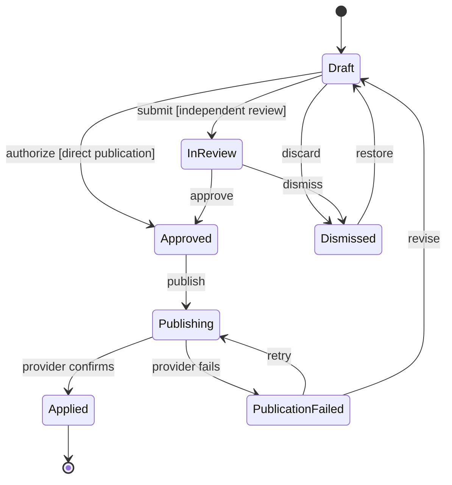
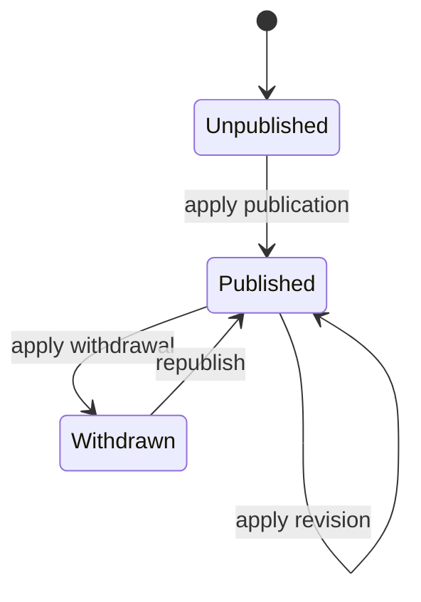

# 0003: Editorial workflow and publication boundary

- **Date:** 2026-09-01
- **Status:** Accepted
- **Supersedes:** The unconditional self-approval rule in 0001

## Context

Lorekind is Git-native, but editorial users should not need to understand
branches, commits, pull requests, merge requests, or provider-specific merge
permissions. They work with drafts, reviews, publication, withdrawal, and queue
resolution.

A contribution in the editorial queue and the canonical entry it may change are
different resources. Removing a contribution from the active queue must not be
confused with withdrawing an already published entry or irreversibly purging
data.

Deployments also need different governance models. Some Folds let an editor
publish their own work, while others require approval from an independent
principal.

## Decision

Lorekind Core defines provider-neutral editorial actions and states. Studio uses
CMS terminology. Git-specific operations remain behind provider adapters.

The contribution workflow is:

The canonical entry lifecycle is separate:

An entry may remain `Published` while a new contribution affecting it is still
`Draft`, `InReview`, or `Publishing`.

The Fold selects one of these review policies:

- **Direct publication:** a principal with `entry:publish` may authorize and
  publish their own contribution.
- **Independent review:** publication requires the configured number of
  approvals from principals other than the contribution author.

Roles are convenient Fold-specific bundles of capabilities; authorization is
decided from capabilities and workflow policy rather than from a hard-coded
role name. A deployment may expose presets such as `editor` and `maintainer`
without making those names universal Core semantics.

At minimum, the workflow distinguishes these operations:

- discard or dismiss a contribution from the active queue;
- restore a dismissed contribution;
- publish an approved or directly authorized contribution;
- withdraw a published entry through a new versioned change;
- purge data only through an explicit privileged and auditable operation.

Provider adapters translate the editorial intent:

| Lorekind action | GitHub adapter                   | GitLab adapter                   | Local test adapter                  |
| --------------- | -------------------------------- | -------------------------------- | ----------------------------------- |
| Submit          | Create or update a pull request  | Create or update a merge request | Persist a proposed change set       |
| Publish         | Merge the pull request           | Merge the merge request          | Apply the change atomically         |
| Withdraw        | Apply a versioned reverse change | Apply a versioned reverse change | Apply the reverse change atomically |

Provider execution is asynchronous. Lorekind records pending, successful, and
failed attempts without treating a transport failure as an editorial rejection.
Retries must be idempotent.

## Consequences

- Studio presents `Save draft`, `Submit`, `Publish`, `Dismiss`, `Restore`, and
  `Withdraw`; it does not expose merge as the editorial action.
- Dismissal remains versioned and identifiable so automated discovery does not
  immediately recreate the same queue item.
- Withdrawing content preserves history. Hard deletion is exceptional and
  separately authorized.
- GitHub, GitLab, and test adapters must implement the same publication
  semantics even though their native operations differ.
- The current unconditional `self-approval` denial in Core must become a Fold
  workflow-policy decision before direct publication is implemented.
- Audit events record the application principal and grant that requested each
  transition, independently of the service identity used with the Git provider.

## Alternatives not selected

- **Expose pull or merge requests as the CMS workflow:** rejected because it
  leaks provider mechanics and requires editorial users to understand Git.
- **Model every removal as deletion:** rejected because queue dismissal,
  publication withdrawal, and irreversible purge have different authorization
  and audit requirements.
- **Always require independent approval:** rejected because it prevents a Fold
  from granting trusted editors direct publication rights.
- **Always allow self-publication:** rejected because community and regulated
  deployments may require separation of duties.
